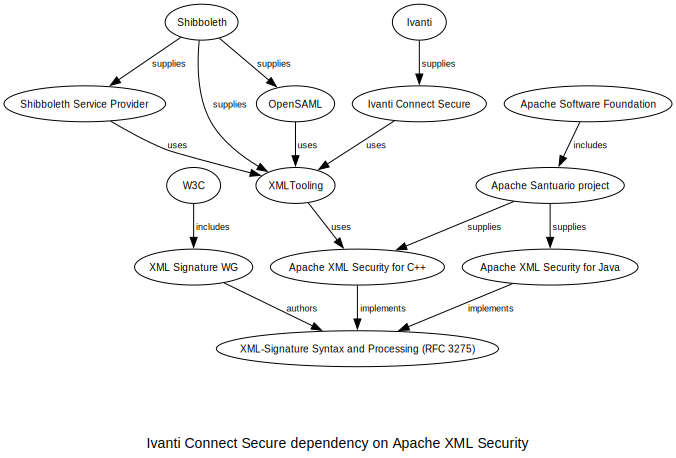
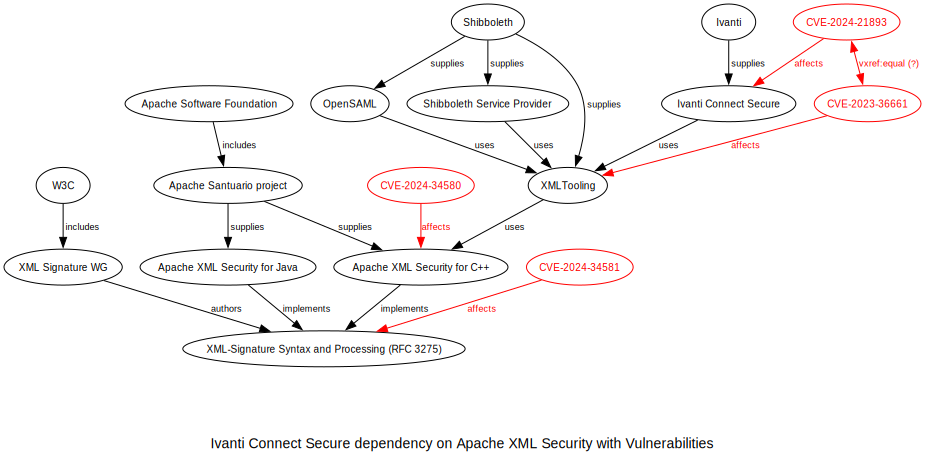

# Notes on [CVE-2024-21893](https://www.cve.org/CVERecord?id=CVE-2024-21893)

## Summary

A vulnerability created partly by a specification is inherited through a supply chain by Ivanti VPN product(s).

CVE-2024-21893: SSRF in "...Ivanti Connect Secure (9.x, 22.x) and Ivanti Policy Secure (9.x, 22.x) and Ivanti Neurons for ZTA." This is due to using (at the time, an unpatched or out-of-date version of) Shibboleth XMLTooling, and arguably could been framed as "These Ivanti products are vulnerable to CVE-2023-36661" instead of assigning a new CVE ID.

CVE-2023-36661: "Shibboleth XMLTooling before 3.2.4, as used in OpenSAML and Shibboleth Service Provider, allows SSRF via a crafted KeyInfo element." [[secadv_20239612.txt](https://shibboleth.net/community/advisories/secadv_20230612.txt)] This is due partly to use of Apache XML Security for C++, maintenance of which is being transfered to Shibboleth. [[XML Security for C++ announcement](https://santuario.apache.org/cindex.html)]

CVE-2024-34580: Apache XML Security for C++, originally developed and maintained by the Apache Santuario project, implements the XML-Signature Syntax and Processing specification, including a recommended but optional mechansim by which to retrieve key information from a remote URL.  Google has provided a [patch](https://services.google.com/fh/files/misc/xml-security-c-2.0.4.patch.zip) in their much more [comprehesive write up](https://cloud.google.com/blog/topics/threat-intelligence/apache-library-allows-server-side-request-forgery) of this issue.

CVE-2024-34581: The XML-Signature Syntax and Processing specification (RFC 3275) includes a recommended but optional mechansim by which to retrieve key information from a remote URL. An [XML Signature Best Practices Working Group Note](https://www.w3.org/TR/2013/NOTE-xmldsig-bestpractices-20130411/) dated 2013-04-11 points out SSRF-related security concerns in Best Practice 7. [XML Signature Syntax and Processing Version 2.0](https://www.w3.org/TR/xmldsig-core2/#sec-RetrievalMethod) (dated 2015-07-23) notes that "The KeyInfoReference element is preferred over use of RetrievalMethod as it avoids use of Transform child elements that introduce security risk and implementation challenges."

CVE-2024-34581 creates a significant opportunity for implementations, by default, to create SSRF vulnerabilities. CVE-2024-34580 propagates this issue by implementing the specification faithfully. In CVE-2023-36661, SSRF is addressed in a downstream implementation. CVE-2024-21893 appears to be a matter of using an out-of-date library that is still vulnerable to CVE-2023-36661, but it's hard to say for certain.

## SBOM graphs

Manually created SBOM and vulnerability graphs and dot source: [sbom_only.dot](assets/sbom_only.dot), [sbom_and_vulnerabilities.dot](assets/sbom_and_vulnerabilities.dot).

